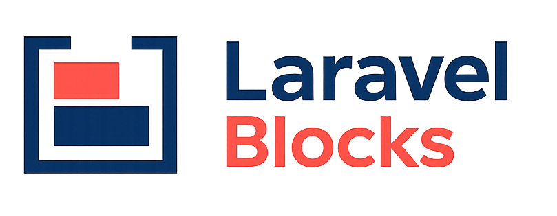

<h1 align="center">
  
</h1>

<p align="center"><strong>A complete Gutenberg-style editing experience for Laravel.</strong></p>

Laravel Blocks is planned as a ready-to-use visual block editor for Laravel. It is designed to give authors a polished Gutenberg-style canvas while letting Laravel applications own their content, models, persistence, Blade output, and custom PHP blocks.

> [!IMPORTANT]
> This repository currently contains the package/toolchain foundation, canonical Document v1 boundary, PHP Block Registry, server-side schema validator, safe Blade renderer, PHP-to-editor manifest bridge, precompiled asset distribution and installer, a replaceable media-provider contract with a zero-database Laravel Filesystem default, a minimal editor shell, the internal editor selection/command layer, package-owned UI primitives with shared Popover infrastructure, rich-text and link controls, top-level block controls, a manifest-driven block inserter/appender, slash commands, a generated Inspector sidebar, visible undo/redo controls with platform shortcuts, top-level drag/drop, Document/List View, and default Paragraph, Heading, List, Quote, Code, and Image blocks. Full mark rendering, nested controls, media-picker UI, and the remaining built-in block catalog remain target milestones until implemented.

## Developer experience

Install the package:

```bash
composer require katonfajar/laravel-blocks
php artisan laravel-blocks:install
```

Add the editor to a Blade form:

```blade
<x-laravel-blocks::editor
    name="content"
    :value="$post->content"
/>
```

The target component includes direct visual editing, selection, contextual and rich-text toolbars, popovers, link editing, the Inserter, slash commands, block movement, drag/drop, a generated Settings Inspector, Document/List View, media picking, nested blocks, patterns, reusable blocks, history, and keyboard navigation. These are core product requirements, not integration work delegated to the consuming application.

Validate and store the submitted Tiptap JSON in an existing `TEXT` or `LONGTEXT` field:

```php
use KatonFajar\LaravelBlocks\Documents\Document;
use KatonFajar\LaravelBlocks\Rules\BlockDocument;

$validated = $request->validate([
    'content' => ['nullable', new BlockDocument],
]);

$post->update([
    'content' => Document::from($validated['content'] ?? null)->toJson(),
]);
```

JSON/JSONB columns are recommended for new applications but are not required. See [Installation and persistence](docs/installation.md) for storage-specific examples.

Render it on the frontend:

```blade
<x-laravel-blocks::content :content="$post->content" />
```

All essential editor JavaScript, CSS, Vue, Tiptap, ProseMirror, positioning logic, and UI primitives MUST ship precompiled in the Composer distribution. A consuming application MUST NOT need Node.js, npm/pnpm/yarn, Vue, Tiptap, ProseMirror, Vite configuration, or a frontend build for the default editor.

## Product direction

Laravel Blocks will provide:

- structured Tiptap JSON as the source of truth;
- Laravel-native registration, validation, rendering, and configuration;
- a complete visual content canvas with bundled toolbars, popovers, Inserter, Inspector, List View, media UI, and keyboard interactions;
- an internally bundled Vue 3 + Tiptap 3 editor with no frontend-build requirement for consumers;
- Gutenberg-comparable interaction quality and editing capability where applicable;
- an independent Laravel Blocks design system, visual identity, tokens, icons, and component styling;
- nested blocks and a curated set of 50 built-in blocks;
- custom blocks defined primarily in PHP;
- first-class Blade component and dynamic Eloquent blocks;
- replaceable media storage and overrideable frontend block Blade views;
- zero required package tables, migrations, or Eloquent models;
- a simple default experience with extensible advanced APIs.

It is not intended to be a CMS, a full page builder, a generic rich-text wrapper, or a pixel-for-pixel Gutenberg clone. Laravel Blocks copies the lessons, not the screenshot.

## Product-owned editor surface

The default editor is a Laravel Blocks product surface. The editor shell, canvas structure, toolbar layout, Inserter, slash menu, Inspector, popovers, modals, selection UI, keyboard behavior, responsive behavior, icons, design tokens, and `.lb-*` control classes are owned by the package and are not a supported override API.

Applications extend the editor by registering blocks, fields, patterns, media providers, and safe frontend render views. Laravel Blocks renders those capabilities through its master editor UI.

## Zero-database core

> **Laravel Blocks does not own your content or database.**

The host application decides which model, table, connection, API, or custom repository stores the canonical Tiptap JSON document. Existing `TEXT` and `LONGTEXT` fields remain valid, while JSON/JSONB columns are a recommendation for new applications.

Core installation never creates or modifies application tables. Shared features such as reusable blocks or editor-managed custom patterns may opt into namespaced package tables or application-provided repository contracts later, but those migrations are always explicit and optional.

## Documentation

The current documentation is a product and engineering specification:

- [Documentation index](docs/README.md)
- [Product definition](docs/product.md)
- [Compatibility](docs/compatibility.md)
- [Architecture](docs/architecture.md)
- [Fundamental decisions](docs/fundamental-decisions.md)
- [Document schema](docs/document-schema.md)
- [Installation and quick start](docs/installation.md)
- [Editor behavior](docs/editor.md)
- [Editor UX contract](docs/editor-ux-contract.md)
- [Design principles](docs/design-principles.md)
- [Built-in blocks](docs/blocks.md)
- [Custom blocks](docs/custom-blocks.md)
- [Rendering](docs/rendering.md)
- [Media](docs/media.md)
- [Patterns and reusable blocks](docs/patterns-and-reusable-blocks.md)
- [Configuration](docs/configuration.md)
- [Integrations](docs/integrations.md)
- [Security](docs/security.md)
- [Roadmap](docs/roadmap.md)

## Compatibility

The package is tested around:

- PHP `^8.2`;
- Laravel / Illuminate `^11.0|^12.0|^13.0`;
- Composer 2;
- Vue 3 and Tiptap 3 as internal build dependencies.

| Laravel | Supported PHP | Laravel Blocks |
| --- | --- | --- |
| 11.x | 8.2-8.4 | CI matrix |
| 12.x | 8.2-8.5 | CI matrix |
| 13.x | 8.3-8.5 | CI matrix |

PHP `^8.2` and the Laravel/Illuminate 11/12/13 target are frozen package constraints. The full [compatibility matrix](docs/compatibility.md) is encoded explicitly in CI so invalid Laravel/PHP combinations are never inferred from a permissive job matrix.

Laravel 11 is upstream end-of-life and its currently resolvable framework versions have active security advisories. The Laravel 11 CI lanes therefore prove package API compatibility under an explicit advisory-block exception; they do not represent a security-support recommendation for new deployments.

## Package identity

| Item | Value |
| --- | --- |
| Product | Laravel Blocks |
| GitHub | `katonfajar123/laravel-blocks` |
| Composer | `katonfajar/laravel-blocks` |
| PHP namespace | `KatonFajar\LaravelBlocks` |
| License | MIT |
| Brand assets | [Logo](logo-laravel-blocks.png) · [Icon](icon-laravel-blocks.png) |

## Development status

The fundamental architecture and mandatory Editor UX are specified. The runnable package/toolchain, immutable canonical Document v1 normalization boundary, abstract PHP Block contract, container-backed Block Registry, executable block/mark schemas, server-authoritative document validator, safe Blade renderer, PHP-to-editor Manifest v1 bridge, precompiled asset installer/distribution boundary, typed media-provider values and Laravel Filesystem default, minimal Vue/Tiptap editor shell, shared editor selection/command layer, UI primitive/Popover infrastructure, rich-text and link controls, top-level block controls, manifest-driven inserter/appender, slash commands, generated Inspector sidebar, visible undo/redo controls with Ctrl/Cmd shortcuts, top-level drag/drop, Document/List View, and package-owned Paragraph, Heading, List, Quote, Code, and URL-backed Image blocks are implemented.

The `0.1` release gate is encoded as an explicit Laravel/PHP CI matrix plus host-persistence, precompiled-installation, and zero-database integration tests. No release or version tag is created by that gate. See the public [roadmap](docs/roadmap.md) for the planned release sequence.
